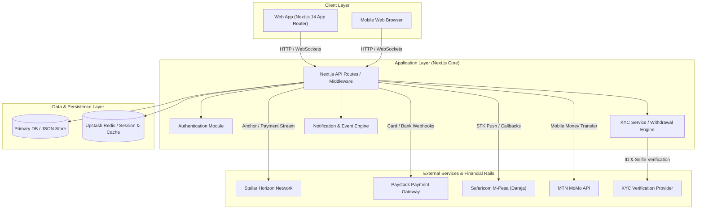
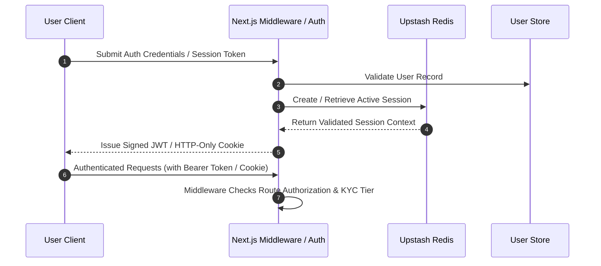

# Architecture Overview

This document provides a comprehensive overview of the **Aframp** system architecture, highlighting component interactions, external service integrations, data persistence layer, and authentication mechanisms.

---

## 1. High-Level System Architecture

Aframp connects fiat financial rails across Africa (Paystack, M-Pesa, MTN MoMo) with the Stellar blockchain network to enable seamless digital asset onramping, offramping, bill payments, and peer-to-peer (P2P) transfers.

---

## 2. Core User Flows

### A. Onramp Flow (Fiat to Crypto)
1. User selects digital asset amount and fiat payment method (Paystack / M-Pesa / MTN MoMo).
2. Application initiates fiat payment request (e.g., STK Push for M-Pesa or Checkout Session for Paystack).
3. Webhook listener receives payment status confirmation from external provider.
4. On success, Next.js backend issues/streams equivalent digital asset (cUSD/USDC/XLM) via Stellar Horizon to the user's wallet address.

### B. Offramp Flow (Crypto to Fiat)
1. User locks or transfers digital assets to the Aframp Stellar anchor wallet address.
2. Aframp monitors transaction completion via Stellar Horizon payment stream.
3. System verifies KYC withdrawal tier limits.
4. System executes fiat payout to user's bank account or mobile money wallet via Paystack Transfer API / M-Pesa B2C.

### C. Bill Payments Flow
1. User selects bill category (utility, airtime, Internet) and enters biller account details.
2. Backend validates biller schema (`lib/biller-schemas.ts`).
3. User confirms payment with digital asset or local fiat balance.
4. System settles payment with bill aggregator and notifies user.

### D. P2P Transfer Flow
1. Sender inputs receiver handle, phone number, or QR code (`lib/transfer-qr.ts`).
2. System resolves recipient wallet address.
3. Assets are transferred on-chain via Stellar Horizon with zero-friction transaction signing.

---

## 3. Data Persistence Layer

Aframp uses a hybrid persistence strategy designed for speed, security, and immutability:

- **Primary Database / Storage**: Manages user profiles, order status, KYC submissions, and biller metadata (`db/` & JSON stores for lightweight caching).
- **Upstash Redis**: Handles rate limiting, ephemeral session tokens, real-time notification streams (`app/api/notifications/stream`), and price alert polling queues (`app/api/pricealerts`).

---

## 4. Authentication Flow

1. **Session Management**: Secure authentication using Next.js Middleware with JWTs or HTTP-Only cookies.
2. **Authorization & RBAC**: Admin routes (`/admin/*`) and business features (`/business/*`) enforce role-based access checks and API key validation (`lib/business/api-keys.ts`).
